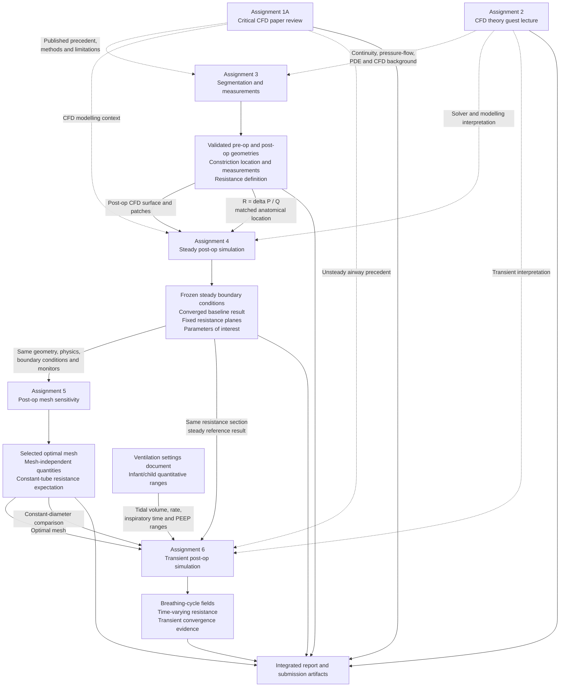
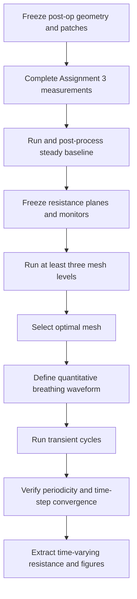

# Dependencies Between Course Assignments

**Course:** Computational Biofluid Mechanics, 2025–2026  
**Student:** Henri Van Overmeire

The assignments are not independent exercises. Assignments 3–6 form a strict
computational chain: anatomy and definitions are established first, the steady
postoperative case defines reusable measurements, mesh sensitivity selects the
final mesh, and only then is the transient case run.

## Dependency diagram



Solid arrows represent **hard dependencies**: a downstream computational task
should not be finalised until the upstream artifact is fixed. Dashed arrows
represent **soft dependencies**: theory, published precedent, or interpretation
that improves later work but does not generate its numerical input.

---

# Assignment-by-assignment dependency details

## Assignment 1A → later assignments

Assignment 1 is not a computational prerequisite, but the selected paper by
Taherian et al. provides directly relevant precedent for:

- Pre-/post-intervention airway comparison.
- Separate inspiratory and expiratory analysis.
- CT-derived patient-specific geometries.
- Inlet and outlet extensions.
- Patient-informed outlet conditions.
- Mesh sensitivity using pressure, velocity, and wall shear stress.
- Rigid-wall and truncated-airway limitations.
- The need to distinguish patient-specific proof of concept from generalisable
  clinical conclusions.

### Dependency type

**Soft.** Assignments 3–6 can run without the paper review, but their methods and
limitations should be informed by it.

---

## Assignment 2 → Assignments 3, 4, and 6

The guest lecture supplies theoretical background for interpreting:

- Continuity-driven velocity changes through a constriction.
- Pressure loss and pressure recovery.
- Viscous versus inertial contributions.
- Incompressibility and local Mach number.
- Steady versus transient CFD behaviour.
- Numerical convergence and equation classification.

### Dependency type

**Soft.** It supports correct interpretation but does not provide geometry,
mesh, or boundary-condition data.

---

## Assignment 3 → Assignment 4

Assignment 3 must establish the anatomical and mathematical basis of the CFD
work.

### Required outputs passed forward

1. **Validated postoperative CFD geometry**
   - Correct segmentation.
   - Centerline-based cuts.
   - Natural flow extensions.
   - One tracheal inlet and three distal outlets.
   - Flat CFD caps.

2. **Validated preoperative geometry and stenosis location**
   - Proximal and distal constriction limits.
   - Minimum centerline-normal area.
   - Matched postoperative location.

3. **Boundary identities**
   - `inlet`.
   - `outlet_1`: right superior lobar bronchus.
   - `outlet_2`: right inferior lobar bronchus.
   - `outlet_3`: left main bronchus.
   - `wall`.

4. **Resistance definition**

   ```text
   R = delta P / Q
   ```

5. **Anatomical target for Assignment 4 resistance**
   - A postoperative pre-bifurcation section corresponding approximately to
     the preoperative constriction.

### Hard gate before Assignment 4

Do not finalise the steady simulation until the postoperative geometry,
extensions, caps, patch identities, and corresponding constriction location are
accepted. Changing these later invalidates resistance planes and all subsequent
mesh comparisons.

---

## Assignment 4 → Assignment 5

Assignment 4 defines the baseline steady model that Assignment 5 must refine
without changing its physics.

### Required outputs passed forward

1. **Frozen postoperative STL and physical patch mapping.**
2. **Frozen steady boundary conditions.**
   - Prescribed tracheal volumetric flow rate.
   - Equal distal pressure reference unless a justified alternative is adopted.
   - No-slip wall.
3. **Frozen fluid properties and solver settings.**
4. **Converged baseline solution.**
5. **Fixed resistance planes.**
   - Origins and normals must be saved numerically.
6. **Automated monitored quantities.**
   - Local resistance.
   - Pressure difference.
   - Axial velocity at the fixed section.
   - Individual outlet flows.
   - Left/right lung flow fractions.
7. **Convergence criteria and residual-processing method.**
8. **Candidate mesh-sensitivity parameters.**

### Hard gate before Assignment 5

A mesh-sensitivity study is invalid if geometry, flow rate, outlet pressures,
solver model, convergence criteria, or measurement locations change between
meshes. Only mesh resolution may change within the primary refinement sequence.

---

## Assignment 4 → Assignment 6

Assignment 6 explicitly requires the local resistance of the **same section** as
the steady case.

### Required outputs passed forward

- Upstream resistance-plane origin and normal.
- Downstream resistance-plane origin and normal.
- Pressure-averaging method.
- Flow-rate sign convention.
- Pressure-unit conversion method.
- Steady postoperative resistance for comparison.
- Steady flow field suitable as an initial condition where appropriate.

### Hard gate before Assignment 6

Do not define transient resistance using newly chosen planes. Otherwise the
steady/transient comparison no longer addresses the assignment's specified
section.

---

## Assignment 5 → Assignment 6

Assignment 5 determines which spatial mesh is sufficiently resolved for the
transient simulation.

### Required outputs passed forward

1. **Optimal postoperative mesh.**
   - Selected from at least three mesh levels.
   - Accepted using predefined tolerances for integral quantities.
   - Supported by runtime/cost comparison.
2. **Mesh-independent monitored quantities.**
3. **Expected constant-diameter resistance behaviour.**
   - For ideal fully developed laminar flow in a rigid tube,
     `delta P = R Q`, so `R` is constant as flow changes.
4. **Known spatial discretisation uncertainty.**

### Hard gate before Assignment 6

Do not spend resources on the final transient run until the optimal mesh is
selected. A transient study on an unverified spatial mesh confounds temporal and
spatial discretisation errors.

---

## Ventilation settings document → Assignment 6

`Settings_for_mechanical_ventilation_of_infants_and_children.md` provides ranges
for volume-controlled ventilation:

- Tidal volume in mL/kg.
- Respiratory rate.
- Inspiratory time.
- PEEP.
- Peak inspiratory flow guidance.
- Flow trigger and pressure-support settings.

These values must be combined with an explicitly selected representative
patient mass and ventilation scenario to construct a quantitative breathing
waveform.

### Important limitation

The document provides general age-group ranges, not patient-specific settings.
A nominal congenital-tracheomalacia infant scenario must be labelled as a
representative modelling assumption and accompanied by low/nominal/high
sensitivity cases where appropriate.

### Hard gate before Assignment 6

Before running the transient model, freeze and document:

- Representative mass.
- Tidal volume per kilogram.
- Absolute tidal volume.
- Respiratory rate.
- Cycle duration.
- Inspiratory and expiratory durations.
- Flow waveform and sign convention.
- PEEP interpretation.
- Air density and viscosity.
- Peak flow, Reynolds number, and Mach number.

---

# Boundary-condition dependencies

## Steady family — Assignments 4 and 5

All mesh levels must use the same physical conditions:

```text
Tracheal patch: fixed total volumetric flow Q_steady
Distal patches: equal fixed pressure reference
Walls: no slip
```

This predicts a geometry-driven left/right flow distribution under equal distal
pressure. It does not predict patient-specific ventilation when peripheral lung
resistance and compliance are unknown.

## Transient family — Assignment 6

The spatial boundary philosophy remains related, but the inlet becomes:

```text
Q = Q(t)
```

for a complete breathing cycle. The distal conditions must allow the required
flow direction and possible reversal. The transient case is not numerically
identical to the steady case because inertia and flow history matter.

---

# Critical path

The shortest valid computational path is:



## Current chronological next step

Assignment 1 is complete. Assignment 2 questions are prepared but require
lecture review and submission. The next computational gate is then Assignment 3:
freeze both geometries and complete the matched anatomical measurements before
further CFD post-processing or mesh refinement.
